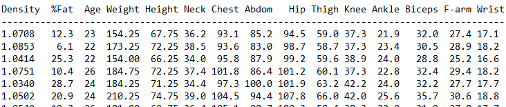

# Exercise week 1

Welcome to the course Advanced Machine Learning! This is your first mandatory exercise which must be completed until next week, i.e. 06.09.2022, 14:00. By that time you must fill out the checklist on the learnit page to indicate which tasks you completed and volunteer to present. 

## Task 0: Preparation work
<ol type ="a">
 <li> Set up your machine such that you can do the programming exercises: python, an IDE of your choice.
 <li> Familiarise yourself with Google Colab.
 <li> Go through the <b>w01_revision_python_basics.py</b>, <b>w01_introduction_to_jupyter_notebook.ipynb</b>, and <b>w01_revision_dataset_visualisation.ipynb</b> and do the optional exercises if you need to brush up your basic python skills.
</ol>

## Task 1: Exploratory Data Analysis Revision 
<ol type ="a">
 <li> Load the data from the bodyfat.txt file as a numpy array and as a pandas data frame and compare the data representation. Note: the file is not a CSV (comma separated values) file. So you may need to do some "cleaning" steps first.

Now we do some Exploratory Data Analysis on your data in the pandas dataframe:

 <li> Go through the documentation of histograms in seaborn and clarify: what are bins and how can this parameter be used? https://seaborn.pydata.org/generated/seaborn.histplot.html

 <li> Plot histograms for different columns of your data.
 <li> Derive some min, max, mean, and standard deviation for some columns of your data and compare.
</ol>

## Task 2: Theory
Given a 2x2 matrix $\mathbf{A}$ and a 2D vector $\mathbf{\mathrm{x}}$ as follows
$$\mathbf{A}=\begin{pmatrix}a_{11} & a_{12}\\\ a_{21} & a_{22} \end{pmatrix} \in \mathbb{R}^{2 \times 2}, ~\mathbf{\mathrm{x}} = \begin{pmatrix}x_1\\\ x_2 \end{pmatrix}  \in \mathbb{R}^{2 \times 1}.$$

<ol type ="a">
  <li>Compute the derivatives of the following functions with respect to their vector- or matrix-valued input. 
Hint:  What dimensions must the derivative of the corresponding function have?</li>
  <ol type ="i">
  <li> $f(\mathbf{\mathrm{x}})=\mathbf{\mathrm{x}}^T\mathbf{\mathrm{x}}$ </li>
  <li> $g(\mathbf{\mathrm{x}})=\mathbf{\mathrm{x}}^T \mathbf{A} \mathbf{\mathrm{x}}$ </li>
  <li> $h(\mathbf{A})=\mathbf{\mathrm{x}}^T \mathbf{A} \mathbf{\mathrm{x}}$ </li>    
  </ol>
 <li>Show that $||\mathbf{A} ||_F^2 = tr(\mathbf{A}^T \mathbf{A}) $</li>
</ol>

Hints:
* Note that all functions take either a vector or a matrix as input and assign one scalar value as output.
* You may find it easier to compute the derivatives per element, which are scalar-valued.

## Task 3: Linear Regression
The file bodyfat.txt contains data of 252 men, where each row contains 15 values for one person. These are measurements related to body fat percentage, age, weight, height, and ten body circumference measurements. The attributes per column are: Density, %Fat, Age, Weight, Height, Neck, Chest, Abdom, Hip, Thigh, Knee, Ankle, Biceps, F-arm, Wrist.

In the following the task is to create a multivariate linear model learnt from a subset of the data (training), to predict the body fat percentage of the rest (test). 

<ol type ="a">
 <li> First use all samples to estimate a 1D regression model from the data to predict the factor 'fat' (column 2), using the variable 'Abdomen' (column 8). 
	$$	y = w_0 + w_1 x + \epsilon,$$
	hence $y:$ fat, $x:$ abdomen. Plot the data points and the regression line. Report the estimated parameters: $w_0, w_1$. </li>
	 <li> Divide the data set into independent training (90%) and test sets (10%). Just as before, we aim to predict the body fat percentage. Estimate the model parameters based on the training data. Then use them to predict the fat percentage. This should be done by using two different models:  </li>
	<ol type ="i">
	 <li> one using the variable Abdomen (column 8) (M1), and  </li>
	 <li> one using columns 3 to 15 (M2).  </li>
  	</ol>
	 <li> Plot the data points and the regression lines for M1 and M2. Report the estimated parameters and the RMSE on training and test set.  </li>  
	 <li> Choose at least two criteria to compare the models (M1) and (M2), and discuss their differences.  </li>
</ol>
  
<!-- 
<ol type ="a">
  <li>Compute direct solution</li>
  <li>Use gradient descent instead of the direct solution</li>
</ol>
-->

