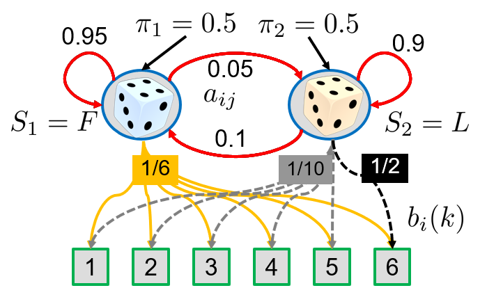

# Exercise week 5

Welcome to the course Advanced Machine Learning! This is your fifth mandatory exercise which must be completed until next week, 04.10.2022, 14:00. By that time you must fill out the checklist on the learnit page to indicate which tasks you completed and volunteer to present.

## Task 1: Determining Hidden Markov Model (HMM)
The HMM below describes the transitions between two hidden states (blue circles), i.e. a fair (F) and a loaded (L) dice, and the resulting emitted observations. 
Depending on the current hidden state (top, blue) one observation (bottom, green), i.e. value between 1 and 6, is emitted. The observed output sequence is obtained by predefined probabilities as given by the values on the edges with matching color. 
This exercise assumes that we observe the outcome of throwing the dice three times. 

Here we follow the notation in [PR] (Bishop), so, use the above HMM $\lambda$ defined by, i.e.: transition matrix $\mathbf{A}$, emission matrix $\mathbf{B}$, initial probabilities $\mathbf{\pi}$, observations $\mathbf{O}$ over the possible observations $\mathbf{X}$, and hidden states $\mathbf{Z}$ denoted $S=\{S_1,S_2\}$

<ol type ="a">
 <li>Write down the transition matrix $\mathbf{A}$ and the emission matrix $\mathbf{B}$.</li>

 <li>For the observation sequence $\mathbf{O}=(1,6,6)$, compute the probability of the hidden sequences (b1) $\mathbf{Z}=(F,L,L)$, and (b2) $\mathbf{Z}=(F,F,F)$, i.e. $P(\mathbf{X},\mathbf{Z}|\mathbf{\theta})$. 
	Which is higher?</li>

 <li>How can the probability of a observation sequence $\mathbf{X}$ given a model $\mathbf{\theta}$, $P(\mathbf{X}|\mathbf{\theta})$ be computed? Give the equation in detail, i.e. how all needed $\mathbf{Z}$ look like. </li>
 <!--/ol>
<ol type ="a" start="4"-->
 <li>Implement a function to compute $P(\mathbf{X},\mathbf{Z}|\mathbf{\theta})$.</li>
 <li>Implement the Forward-Algorithm. Compute 6.2(c) using Python code, i.e. define a function, which:
  
- receives as input an observation sequence $\mathbf{X}$, and
- provides the probability of on the observation sequence $P(\mathbf{X}|\mathbf{\theta})$ as output.

*Hint*: Consider how do you get all needed combinations of the hidden state sequences? Then start with a fixed observation length of your choice, e.g. 3, then expand to arbitrary lengths.

</li>
</ol>

## Task 2: Understanding Basic Recurrent Neural Networks (RNNs)

In this exercise we aim to understand how RNNs are implemented and used in a current Deep Learning framework (in this case: pytorch), via 
https://colab.research.google.com/github/probml/probml-notebooks/blob/master/notebooks-d2l/rnn_torch.ipynb

The example notebook includes many steps, so take your time and read carefully. Also, focus on the questions below, otherwise this might way too much take in.

<ol type ="a">
 <li>Retrace the data loading and preprocessing and take your time to clarify:

  - How and why is the vocabulary dictionary built up?
  - What is the role of "num_steps"?</li>

 <li>Retrace the model (first the implementation from scratch, then the RNN sub-module of the framework) and familiarise yourself with the data structure of the network tensor: ('num_steps', 'batch_size', 'vocab_size')

  - Why is it a good idea to fix these parameters in the model building?
  - What is the effect of a small versus a large vocab_size?</li>

 <li>Retrace the training steps and focus on the following questions:

  - How and why are <b>hidden states</b> initialised during training batches (and how is this different to non-Recurrent NN training)? 
  - Specifically: what would be the effect of initialising vs not initialising hidden states at the beginning of each first time step of a sequence?</li>
 <li>Initialise the hidden states (init_rnn_states) instead of with zeros with other values (e.g. random values between 0 and 1). 

  - What is the effect?
  - How does the training behave when we use no gradient clipping?
  - What is the effect on the training when using other values for num_steps: e.g. 15, 60, and 120?</li>
</ol>

## Task 3: Understanding Gating in RNNs

Now we switch to tensorflow(-keras) and explore gating in RNNs
via https://colab.research.google.com/github/tensorflow/text/blob/master/docs/tutorials/text_generation.ipynb

The example is also long but shows you the major steps in solving NLP tasks with RNNs. So carefully go through all steps and learn how technical details are realised differently from torch.
 
Retrace the implementation of the model and:

<ol type ="a">
 <li>Modify the example to run with the SimpleRNN instead of the GRU and note down your results as a baseline. How did the network perform (quality)?</li>
<li>Now run the model using GRU: what are the major effects in training (speed and convergence) and results (quality)?</li>
<li>Modify the example to run with LSTM cells instead: 

  - What is the effect? 
  - Is the performance different than compared to using GRU?</li>
<li>Compare the parameters of the needed number for decent performance between GRU, LSTM and the baseline (the baseline/SimpleRNN might not converge)?</li>
</ol>

## Task 4: Understanding Word Embeddings

Next, we dive deeper inter representations, particularly word embeddings for natural language processing. 

<ol type ="a">
 <li>So, first of all, explore learned word embeddings with Word2Vec via

http://projector.tensorflow.org/

   - What is the difference in data and effect of Word2Vec All, Word2Vec 10k?
   - What are your most 1) intuitive and 2) counter-intuitive observations regarding the vector spaces?
</li>
<li>Next, reproduce how building embeddings from skip-grams work (again, focus on the questions below, otherwise you might drown in code and details) via

https://colab.research.google.com/github/probml/probml-notebooks/blob/master/notebooks-d2l/skipgram_torch.ipynb

  - *Hint*: Check the tutorial https://www.tensorflow.org/text/guide/word_embeddings
  - Refresh yourself and understand: how is the tokenisation realised?
  - Try different embedding sizes. How do similar tokens compare? Test own token examples as well!
  - Figure out and test different window sizes for the skip-grams. What is the impact on quality (e.g. similarity of tokens) vs. effort (training speed and convergence)?
 </li>
</ol>

## Optional expert task 5:  Explore text classification (Seq to Vec) and image captioning examples

https://colab.research.google.com/github/tensorflow/text/blob/master/docs/tutorials/text_classification_rnn.ipynb
https://colab.research.google.com/github/tensorflow/docs/blob/master/site/en/tutorials/text/image_captioning.ipynb

And familiarise yourself for each about:

<ol type ="a">
 <li>How is the data preprocessed and represented?</li>
 <li>How (technically) is the vector information fed into and read from the RNN?</li>
</ol>
