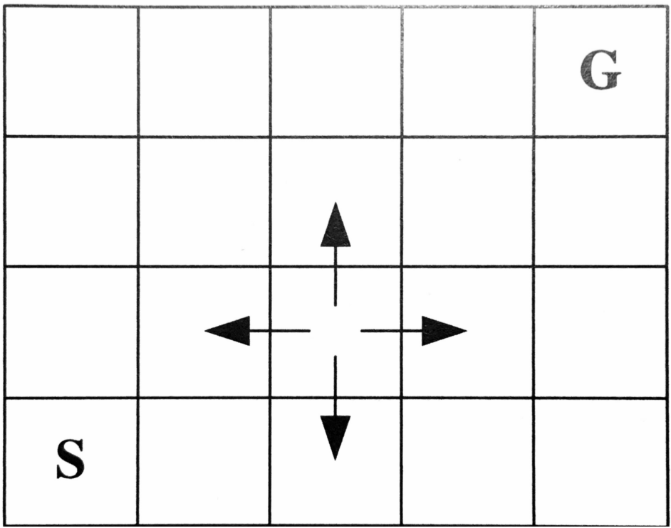

# Optional bonus exercise week 10

This is your 10th exercise, which is optional and supposed to fill up some completion points in case you are overall not reaching 50% yet. Otherwise, the exercises should still provide useful insight. In any case, if you do take part, the exercises must be completed until next week, 15.11.2022, 14:00. By that time, you must fill out the checklist on the learnIT page to indicate which tasks you completed and volunteer to present.

## Optional task 1: Meta-Learning
Meta-learning is an emerging field with an inconsistent and broad taxonomy. So we approach this by looking into a recent review paper to clarify some key ideas and directions.

For this, read into [Hospedales et al. 2020: Meta-Learning in Neural Networks: A Survey](https://arxiv.org/abs/2004.05439), and let's discuss in class:

<ol type ="a">
  <li>What are the key differences in of meta-learning algorithms?</li>
  <li>How does MAML relate to the meta-learning components: Objective, Representation, Optimizer?</li>
  <li>What are the major problems in meta-learning?</li>
  <li>What are key applications for meta-learning?</li>
</ol>

## Optional task 2: Reinforcement Learning
In the next task, we practise some basics of reinforcement learning. 

Consider the following grid world:

An agent can move in the four compass directions starting from start state $S$ wanting to move to goal state $G$.
<ol type ="a">
  <li>With the conditions of the reward on reaching on the goal being $100$ and discount factor $\lambda = 0.9$, manually calculate $Q_{\pi}(s, a)$, $V_{\pi}(S)$, and then list the actions of optimal policy.</li>
  <li>With the same configuration, now solve the problem with a small program by using Q-learning to learn the optimal policy.</li>
</li>
</ol>

## Optional expert task 3: Reinforcement Learning with Neural Networks
Next, let's go through <a href='https://www.gymlibrary.dev/'>Gym</a>, an OpenAI project that provides a simple API to interact with a variety of environments. These include the Atari games to Classical Control problems. We will focus on `CartPole-v1`, an environment from the latter in which a pole is balanced and solve this via *w10_rl_dqn_pytorch.ipynb*. 

<ol type ="a">
  <li>In order to do this, you need to implement an agent that has a model. The model should be a neural network that, given an environment observation, outputs an action. The agent has this model as one of its attributes.</li>
  <li>Another attribute the agent should have is memory: for each action taken, it should store the state, the next state, the action, the reward, and a boolean variable telling whether the agent died (pole fell) or not after taking that action. The model should be linear, and given input, output a vector representing the best guess about the value of each of the potential actions.</li>
  <li>After every game, train on a batch from memory. The prediction is the predicted value of the actions taken given the state, and the target is the value of the next state (unless you die). </li>
</ol>

## Optional task 4: Course Recap

With the following quiz, let's test your understanding of machine learning paradigms and revisit some of the course material. 

<ol type ="a">
  <li>State which of the following methods/algorithms are (un)supervised.
    <ol>
      <li>PCA</li>
      <li>Convolutional Neural Networks</li>
      <li>Gaussian Mixture Models</li>
      <li>Transformers</li>
      <li>Variational Autoencoders</li>
      <li>Generative Adversarial Networks</li>      
      <li>Model-agnostic Meta-Learners</li>
    </ol>
  </li>  
  <li>Match the distribution (i-iv) to the descriptions (a-c). (none, one, or multiple possible.)
   <ol>
      <li>Bernoulli Distribution</li>
      <li>Binomial Distribution</li>
      <li>Gaussian (Normal) distribution</li>
      <li>Gamma distribution</li>
    </ol>
  <ol type="A">
      <li>binary</li>    
      <li>discrete</li>
      <li>continuous</li>    
    </ol>    
  </li>
  <li>For the distributions from the previous task, look up the following: What parameters define the distribution? What are the expectation value and the variance? </li>  
  <li>Which of the following methods offer a direct solution, and which are iterative?
    <ol>
      <li>PCA</li>
      <li>Standard Linear Regression Model</li>
      <li>Perceptron Algorithm</li>
      <li>Expectation Maximization Algorithm</li>      
      <li>Generative Adversarial Network</li>
      <li>Gradient-based Meta-Learners</li>
    </ol>
  </li>  
 <li>You want to do classification. Which method(s) can you choose for the following settings?
    <ol>
      <li>Your data consists of two classes, and you only want to have the class decision, i.e. you are not interested in the certainty of your decision per sample.</li>
      <li>Your data has more than two classes, and you only want to have the class decision.</li>
      <li>For each new sample you assign a class to, you want to have a measure for how certain you can be that the sample belongs to one class.</li>
    </ol>
  </li>
  <li>Assume you are asked to perform a multivariate regression task of some data, i.e. you want to predict one value $y$ from several inputs $x_i$. When exploring the data in your $x$ values, you find that it contains two columns which refer to the same weight but in different units, i.e. kg and lbs. Your colleague argues to keep both columns. Elaborate if this is a good or bad idea.</li>
</ol>

Make use of this task to identify gaps in your understanding and use the chance to bring them up in plenum!
