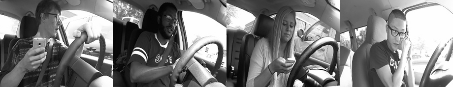

### Classifying distracted car drivers

Motivated by the fact people are being injured and killed by distracted drivers, we aim to build assistive systems into vehicles. 
In this project we work towards building a scene understanding pipeline that is able to detect drivers engaging in distracting behaviours. 
This task is based on [this kaggle challenge](https://www.kaggle.com/competitions/state-farm-distracted-driver-detection/data).
For this project, we would not expect to have the time and experience to solve the challenge or get scores that would be high on the leaderboard, but we want to go towards it!

#### Main goals:

- Go through the challenge description carefully and acquire the StateFarm dataset provided for a start. Furthermore, you might want to go through the code resources in the challenge and look through paperswithcode and general literature to get some ideas for scene understanding tasks. What are effective and feasible strategies?
- Study the dataset and identify ideal pre-processing steps and subtasks.
- Develop a distracted driver detection pipeline that reliably proposes a driver state per frame. Consider pre-trained models as part of your solution and aim for a particularly robust understanding of the visual scenes. What are your pipeline components, and what meta-parameter did you identify as good?
- An important component of this project is behaviour over time. Can you come up with a taxonomy of pos-processing your results, such as to weight "distraction" outcomes over time?
- Discuss the ethical considerations of such a project. What are the implications and dangers?

#### Optional:
- Search and identify other datasets and problems that are related to the challenge and try to generalise your results. Does your pipeline also work well in related problems, such as checking the driver's hand motions from 3D data (https://paperswithcode.com/dataset/drivermhg) or checking the passenger safety at railroad stations (https://paperswithcode.com/dataset/raileye3d-dataset)?
