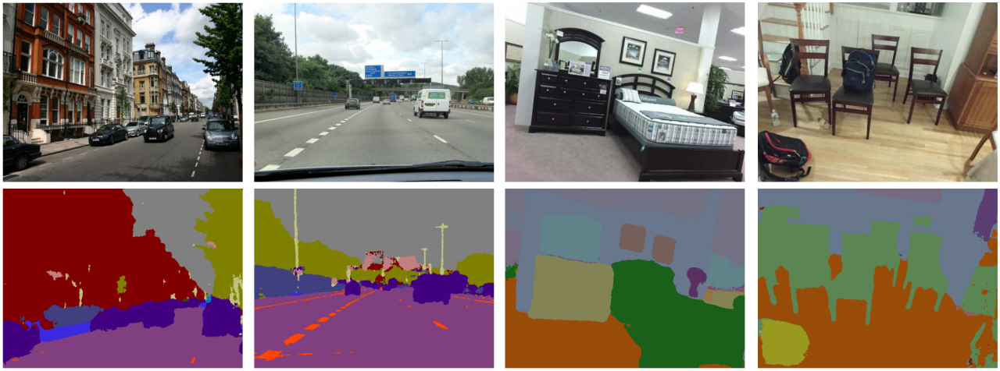

### Image segmentation with deep encoder-decoder networks.

Image segmentation is a a key task, and important step in visual scene understanding. In this project, we aim to solve image segmentation with deep neural networks by utilising our experiences with autoencoders and data augmentation. In particular, we want to find the best segmentation for:
- the road scene data set [CamVid](http://mi.eng.cam.ac.uk/research/projects/VideoRec/CamVid/) or 
- the indoor scene data set [SUN RGB-D](https://rgbd.cs.princeton.edu/).

#### Main goals:

- Do a quick literature research for the state of the art approaches. Which strategies are most promising, and are there code examples that we should reuse here? (Copied code can only be a part of your solution if it is fully understood and referenced.)
- Develop a deep encoder-decoder network for image segmentation to either solve the road scene data. Which general architecture and training strategy is best?
- Run a propper ablation study for the hyperparameters, i.e. systematically study *good* parameter settings. Reflect what "good" means. 
- Investigate different strategies of using pre-trained layers and fine-tuning as well as well-performing data augmentation. How does this affect the solution, e.g. are particular image component covered better?
- Investigate edge cases (specific scenes that underperform) in depth. Can you identify and improve the underlying problem?

#### Optional:
- Identify key tradeoffs for performance versus key limitations, such as memory and training times in your image-segmentation ML pipeline. Can you come up with some approximate alternatives for some of these tradeoffs (i.e. how you encode and use feature maps)?
- Solve both road scene and indoor scene segmentation in the very same architecture. Can you identify pre-training and fine-tuning options that lead to a good performance on both?
