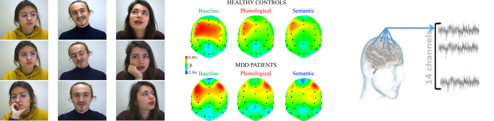

### Estimation of Psychlogical and/or Physiological Information

During the course, you also learnt to deal with temporal data. 
In this project, we want you to focus on human data and retrieve psychological and/or physiological information which can be used to help diagnose people. As this is a particularly broad overall goal, it is up to choose between the following databases...

* [UBFC-Phys dataset](https://ieee-dataport.org/open-access/ubfc-phys-2) contains recordings of 56 participants with labels for stress level
* [DASPS database](https://ieee-dataport.org/open-access/dasps-database) contains EEG signals of 23 participants with labels for anxiety
* [The Depresjon Dataset](https://datasets.simula.no/depresjon/#dataset-details) contains motor activity recordings of 23 unipolar and bipolar depressed patients and 32 healthy controls, more [here](https://www.kaggle.com/datasets/arashnic/the-depression-dataset).

... and since the bio-physiological/EEG/actigraph datasets provide different labelling, also choose between the following tasks:

- Stress level recognition
- Anxiety level estimation
- Heart-rate estimation 
- Depression state classification
- Montgomery–Asberg Depression Rating Scale (MADRS) prediction

#### Main goals:

* Inspect the datasets, identify which tasks are feasible and most interesting, and research existing literature. For this, also research into appropriate preprocessing and representation of the measured data.
* Develop a prediction or classification model for your chosen task, e.g. based on CNNs, RNNs, Transformers, or Generative Models. What architecture (and hyper-parameter setting) can be trained to predict such scarce, noisy, and high-dimensional data well?
* Study the performance for edge cases, such as individuals with particularly extreme activations or rare pathological conditions. Can you identify characteristics of such edge cases that result in particularly high or low performance of your model?
* Identify differences in quantitative performance and qualitative characteristics of different related tasks (e.g. stress level vs. anxiety level).

#### Optional:

* Search for similar data sets from other labs to compare how your model and its results generalise. Potentially you might find data that is even more scarce (only a few measurements despite high noise and a high number of measured dimensions). 
* Compare different options for preprocessing. Can you find noise-filtering approaches that are universally useful? Do pre-trained models exist that are transferrable to your bio-physiological/EEG/actigraph data?
